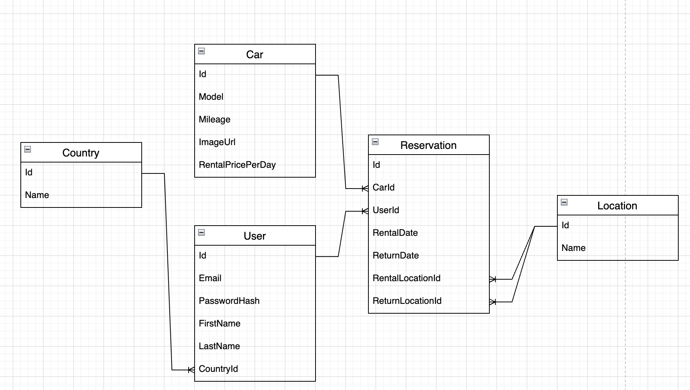
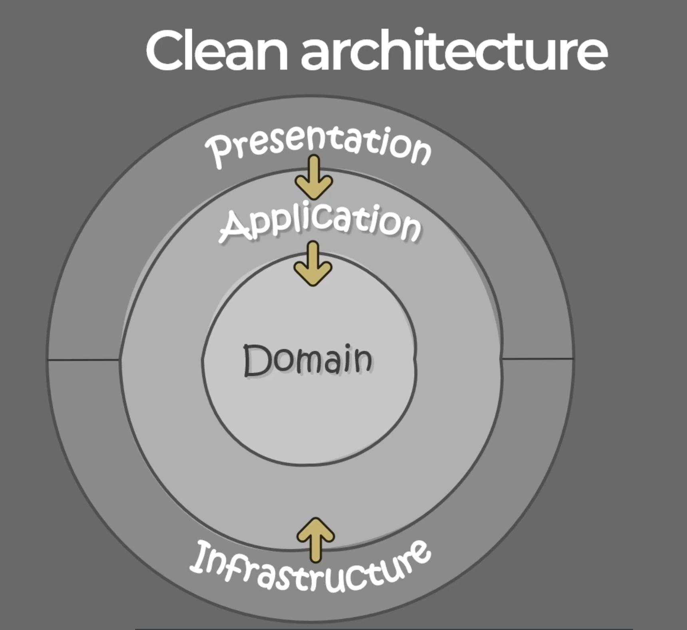

# Tesla Rental App

1. Uruchomienie programu

Aby uruchomić program wystarczy wykonać polecenie **docker-compose up**

2. Założenia zadania

- Samochody wypożyczane są na pełne dni, możliwe jest wypożyczenie samochodu na jeden dzień
- Każdy samochód zawiera cenę wypożyczenia za jeden dzień, przez co jestem w stanie wyznaczyć cenę całkowitą wypożyczenia
- Samochód może zostać wypożyczony z dowolnej lokalizacji oraz zwrócony do dowolnej lokalizacji

3. Podejście w rozwiązaniu zadania

Pierwszym krokiem jaki poczyniłem było przeanalizowanie treści zadania, określenie założeń wyżej wymienionych. Po wykonaniu tych czynności utworzyłem schemat bazy danych, forma graficzna pozwoliła mi upewnić się, że mój tok myślenia oraz cały schemat bazy danych ma rację bytu. Chciałem jak najlepiej odwzorować rozwiązywany problem i zrzutować go na encje bazodanowe z odpowiednimi atrybutami

Po wykonaniu tych czynności przeszedłem do kodowania rozwiązania. Aby zachować odpowiednią strukturę projektu zastosowałem Clean Architecture. Podzieliłem mój projekt na 4 warstwy:

- Presentation
- Application
- Domain
- Infrastructure

Następnie zgodnie ze wzorcem utworzyłem relacje między tymi warstwami tak aby warstwa zewnętrzne mogły sięgać do zasobów z warstw wewnętrznych. Dzięki temu osiągnąłem przejrzysty podział kodu pozwalający mi w komfortowo rozwijać aplikację i zapewniający zrozumienie jej struktury dla osoby z zewnątrz.

  

Po utworzeniu struktury projektu przeszedłem do stworzenia bazy danych oraz zaseedowania danych stałych takich jak samochody czy lokalizacje. Następnie przeszedłem do utworzenia użytkownika oraz mechanizmu jego autentykacji opartego na tokenie JWT. Jest to istotny element rozwiązania gdyż czynności takie jak wypożyczanie możliwe są do wykonania tylko przez zalogowanego użytkownika.

Aby zapewnić odpowiednią architekturę aplikacji, wykorzystałem wzorzec CQRS, implementując go za pomocą pakietu MediatR. Dzięki temu mogłem oddzielić logikę odczytu od logiki zapisu, co umożliwiło bardziej przejrzystą i skalowalną strukturę kodu. Wykorzystanie wzorca Mediatora pozwoliło na efektywne zarządzanie zależnościami i komunikacją pomiędzy komponentami systemu.

W przypadku zapytania zwracającego rezerwacje danego użytkownika dodałem również generyczną paginacje i filtrowanie po parametrach: [model samochodu, data wypożyczenia, data zwrotu, cena całkowita]

Kolejnym etapem było zadbanie o odpowiednią walidację i kontrolę poprawności zachowania zapytań. W tym celu odpowiednie zapytania są walidowane za pomocą narzędzi z pakietu Fluent Validation oraz w przypadku wystąpienia wyjątków są one obsługiwane przez stworzone customowe wyjątki:

- CarNotAvailableException
- NotFoundException
- UnauthorizedException

Wyjątki te są przechwytywane w utworzonym ErrorHandlingMiddleware, który obsługuje je nadając im odpowiedni ErrorCode. W przypadku wystąpienia któregoś z nich zwracany jest wynik w postaci obiektu json w postaci obiektu {title,status,message};
Dodatkowo stworzyłem RequestTimeLoggingMiddleware, który monitoruje zapytania, które trwały powyżej 4s.

Aby dobrze monitorować aplikację zadbałem o logowanie wszystkich zdarzeń za pomocą narzędzia Serlilog. Wszystkie zdarzenia zapisywane są do odpowiedniego pliku w katalogu Logs. Nowy plik jest tworzony tam każdego dnia w celu lepszego zarządzania logowanymi informacjami.

Dokumentacja mojego API znajduje się w autogenerowanym swaggerze.

4. Dodatkowe elementy rozwiązania

W ramach rozwiązania zadania utworzyłem również front aplikacji w technologi React (Next.js), jako bibliotekę komponentów wykorzystałem Material UI, a do komunikacji z API oraz zarządzaniem stanem aplikacji wykorzystałem bibliotekę @tanstack/react-query. Każdy routing z mojego API został upakowany w customowy hook poprawiający czytelność i utrzymanie kodu. Dodałem dodatkowo internacjonalizacje aby dostosować stronę do obsługi języka polskie i angielskiego. 
Na koniec dokonałem konteneryzacji mojego rozwiązania w Dockerze aby można było ja komfortowo uruchamiać.
